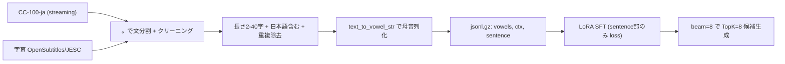

# project06 — 母音列→文 復元 AI モデル

母音のみで入力された文(例 `o o a e n i a a u a a`)から、元の文(`今日は天気が悪かった`)をそのまま復元する生成モデル。
CC-100 と字幕(OpenSubtitles/JESC)を混ぜたコーパスを「。」で区切って1文ごとに学習する。
`MiniCPM4-0.5B` + LoRA の生成SFT(project05_02 を雛形)。

## できること

- 入力: 母音列(vowels, 空白区切り a/i/u/e/o/n) + 任意の文脈(ctx = 一個前の文)
- 出力: 復元文候補 TopK(ビーム生成。寒い/暑いのようなブレを複数提示)

| 入力 vowels | 出力(候補の例) |
| --- | --- |
| o o a e n i a a u a a | 今日は天気が悪かった |
| i a a a a e i a u | 今から帰ります |

母音列のみ / 母音列+ctx の両方に対応(ctx 無しは内部で `<NONE>`)。

## 設計

- 形式: 自由生成(SFT)。プロンプト `... VOWELS: o o a ...\nSENTENCE:` → モデルが `今日は天気が悪かった` を生成。
- データ:
  - CC-100-ja(`range3/cc100-ja`)と字幕(`Nan-Do/OpenSubtitlesJapanese`, `nntsuzu/JESC`)を同程度の件数で交互に混合。
  - 原文を「。」(! ? も含む)で文分割し、空白詰め・日本語含む・長さ 2〜40 字でフィルタ。
  - 母音列化は `vowel_utils.text_to_vowel_str`(pykakasi で漢字込みの任意文を母音化、空白区切り出力)。
  - ctx は同一原文内の直前の文(原文)。文チャンク先頭は `<NONE>`。さらに `none_ctx_ratio`(既定0.5)で `<NONE>` に落とし、母音列のみでも復元できるようにする。



## ファイル構成

```
project06/
├── README.md
├── requirements.txt
├── tanakamemo.txt              # データ生成/学習/推論/評価コマンドメモ
├── corpus_utils.py             # 「。」区切り文分割 + クリーニング
├── vowel_utils.py              # ひらがな/漢字 → 母音列(project02_2 から複製)
├── make_vowel_dataset.py       # CC100+字幕 → ../dataset/project06/{train,eval}.jsonl.gz を生成
├── train_vowel_lora.py         # 文復元SFT 学習 (sentence部のみ loss マスク)
├── infer.py                    # CLI 推論
├── serve_api.py                # HTTP 推論 (POST /predict)
└── paper/scripts/              # 論文用評価 (dump_predictions.py → evaluate_for_paper.py: Acc@k / KSPC)
```

## セットアップ

```bash
source /home/shunsuke/Desktop/venv/pytorch_gpu/bin/activate
pip install -r requirements.txt
```

## 使い方

データ生成 → 学習 → 推論/評価 の順。詳細コマンドは `tanakamemo.txt` を参照。

### データ生成

```bash
python make_vowel_dataset.py --cc100_rows 1000000 --subs_rows 1000000
```

学習/評価データは `../dataset/project06/{train,eval}.jsonl.gz` に出力される。

### 学習

```bash
python train_vowel_lora.py \
  --train_path ../dataset/project06/train.jsonl.gz --eval_path ../dataset/project06/eval.jsonl.gz \
  --max_train_records 2000000 --epochs 2 --batch 8 --grad_accum 4
```

LoRA アダプタ・ログ・学習曲線は `logs/train_YYYYMMDD_HHMMSS/` に保存される。

### 推論 (CLI)

```bash
python infer.py --lora_dir logs/train_YYYYMMDD_HHMMSS --vowels "o o a e n i a a u a a"
python infer.py --lora_dir logs/train_YYYYMMDD_HHMMSS --vowels "i a a a a e i a u" --ctx "今日は天気が悪かった"
```

### 評価 (Acc@k / KSPC)

```bash
python paper/scripts/dump_predictions.py --lora_dir logs/train_YYYYMMDD_HHMMSS \
  --eval_path ../dataset/project06/eval.jsonl.gz --max_records 500 --k 8 \
  --out paper/results/preds_proposed.jsonl
python paper/scripts/evaluate_for_paper.py --pred_path paper/results/preds_proposed.jsonl \
  --out_dir paper/results --tag proposed
```

### 推論 (HTTP API)

```bash
LORA_DIR=logs/train_YYYYMMDD_HHMMSS uvicorn serve_api:app --host 0.0.0.0 --port 8000
curl -X POST http://127.0.0.1:8000/predict \
  -H "Content-Type: application/json" \
  -d '{"vowels":"o o a e n i a a u a a","ctx":"","k":8}'
```

### 実ユーザ実験 (認知負荷評価) 計測アプリ

スマホ/PC のブラウザから LAN 経由で使う計測 Web アプリ。
コンセプトは「母音に変換するストレス」と「予測変換が正確に機能するか」を切り分けて測ること。
2軸(IME / 母音)×2(推論なし / あり)の4モードで課題を行う。

| | 推論なし | 推論あり |
| --- | --- | --- |
| IME | 1. IMEひらがな(全てひらがな入力。電話→でんわ) | 3. 標準IME(漢字変換あり) |
| 母音 | 2. 母音入力(母音列を打つ。電話→e n a) | 4. 母音(推論こみ / 推論はせず) |

課題文を一定時間(3秒)表示→隠す→入力させ、入力時間・打鍵数・Backspace数・打鍵間隔・
母音化誤り率(母音化CER。モード2/4で算出)・正答率を `study/<セッション>_<名前>/results_trials.csv` に保存する。
アンケートは母音7項目 / IME3項目を `results_survey_{vowel,ime}.csv` に保存する。

```bash
# 1) 課題文セット(Level1=単語 / Level2=短文 / Level3=一般文)を生成
python make_study_sentences.py            # -> study/sentences.csv

# 2) アプリ起動(母音モードを使う=GPU必要。LORA_DIR を指定)
LORA_DIR=logs/train_YYYYMMDD_HHMMSS python study_app.py   # 既定ポート 8001

# 母音モデルを使わず IME モード/アンケートだけ動かす(GPU不要・デバッグ用)
STUDY_NO_MODEL=1 python study_app.py
```

同一 LAN のスマホから `http://<PCのIP>:8001/` を開く。
結果は被験者ごとに `study/<日付>_<名前>/` フォルダへ分けて保存される
(`results_trials.csv`=試行、`results_survey_{vowel,ime}.csv`=アンケート)。
課題文(単語集)は各 Level 3 文ずつ(計 9 文)で、`make_study_sentences.py` 内のリストを編集して差し替える。

## データ形式 (jsonl.gz)

```json
{"vowels": "o o a e n i a a u a a", "ctx": "<NONE>", "sentence": "今日は天気が悪かった"}
{"vowels": "i a a a a e i a u", "ctx": "今日は天気が悪かった", "sentence": "今から帰ります"}
```

## プロンプト形式 (train/infer/serve で完全一致)

```
あなたは日本語IMEの文復元器です。
母音列(a/i/u/e/o/n)から元の文を復元してください。
CTX: {ctx}
VOWELS: {vowels}
SENTENCE:
{sentence}
```

学習時は `SENTENCE:\n` までを prompt(`label=-100` マスク)、`{sentence}`+EOS のみ loss をかける。

## 主なハイパーパラメータ

| 項目 | デフォルト | 説明 |
| --- | --- | --- |
| min_len / max_len | 2 / 40 | 文の文字数フィルタ |
| none_ctx_ratio | 0.5 | CTX を `<NONE>` にする割合(母音列のみ入力対応) |
| max_seq_len | 128 | 学習時の最大トークン長 |
| num_beams / k | 8 / 8 | 推論のビーム幅・候補数 |
| max_new_tokens | 64 | 生成最大トークン(40字相当) |
| base | openbmb/MiniCPM4-0.5B (rev 2aaa97c53d) | ベースモデル |
| LoRA | r=32, alpha=64, dropout=0.05 | アダプタ設定 |
