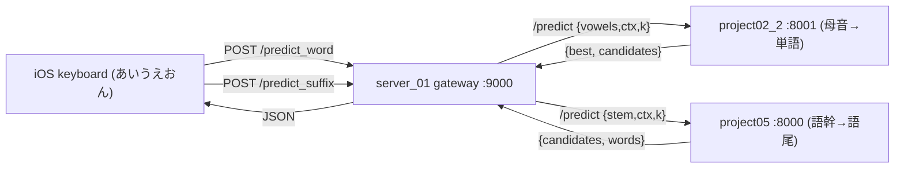

# project_server_01 — IME統合ゲートウェイサーバー

`project02_2`(母音→単語予測)と `project05`(語幹→語尾予測)を組み合わせて、日本語IMEを実現するための薄いゲートウェイサーバー。

iOSキーボード(あ/い/う/え/お/ん の6キー)からは、このゲートウェイの2エンドポイントだけを叩けばよい。ゲートウェイ自身はモデルをロードせず、リクエストを02/05へ転送する。

## アーキテクチャ



## ポート割り当て

| サーバー | 役割 | ポート |
| --- | --- | --- |
| project02_2 | 母音列 → 単語(漢字交じり)候補 | 8001 |
| project05 | 語幹 → 語尾候補 | 8000 |
| project_server_01 | ゲートウェイ(02/05へ転送) | 9000 |

## ファイル構成

```
project_server_01/
├── README.md
├── requirements.txt        # fastapi / uvicorn / httpx
├── gateway.py              # /predict_word, /predict_suffix, /health
└── run_all.sh              # 02/05/gateway を3プロセスまとめて起動する補助
```

## セットアップ

```bash
source /home/shunsuke/Desktop/venv/pytorch_gpu/bin/activate
pip install -r requirements.txt
```

(02/05 側の依存は各 `project02_2/requirements.txt`, `project05/requirements.txt` を参照)

## 起動方法

### まとめて起動(推奨)

```bash
bash /home/shunsuke/Desktop/proj/20260609/project_server_01/run_all.sh
```

3プロセスが立ち上がり、ログは `project_server_01/{word,suffix,gateway}.log` に出力される。

### 個別に起動

```bash
source /home/shunsuke/Desktop/venv/pytorch_gpu/bin/activate

# 1) 単語予測 (02)  cwd=project02_2
cd /home/shunsuke/Desktop/proj/20260609/project02_2
uvicorn serve_api:app --host 0.0.0.0 --port 8001

# 2) 語尾予測 (05)  cwd=project05  (smokeモデル。本番は lora_suffix_out)
cd /home/shunsuke/Desktop/proj/20260609/project05
LORA_DIR=lora_suffix_smoke uvicorn serve_api:app --host 0.0.0.0 --port 8000

# 3) ゲートウェイ (server_01)  cwd=project_server_01
cd /home/shunsuke/Desktop/proj/20260609/project_server_01
uvicorn gateway:app --host 0.0.0.0 --port 9000
```

転送先は環境変数で上書き可能:

| 環境変数 | デフォルト | 説明 |
| --- | --- | --- |
| `WORD_API_URL` | `http://127.0.0.1:8001` | 02(単語予測)のURL |
| `SUFFIX_API_URL` | `http://127.0.0.1:8000` | 05(語尾予測)のURL |

## エンドポイント仕様

### POST /predict_word — 母音列から単語を予測(02を呼ぶ)

リクエスト:

```json
{ "vowels": "a e", "ctx": "午後から", "k": 5 }
```

| フィールド | 型 | 必須 | 説明 |
| --- | --- | --- | --- |
| vowels | string | ◯ | `a i u e o n` を半角スペース区切り(あ→a, ん→n 等) |
| ctx | string | | 直前までの確定文(任意) |
| k | int | | 返す候補数(デフォルト 5) |

レスポンス:

```json
{ "best": "雨", "candidates": ["雨", "汗", "風", ...] }
```

### POST /predict_suffix — 確定した単語(語幹)から語尾を予測(05を呼ぶ)

リクエスト:

```json
{ "stem": "寒", "ctx": "今日は", "k": 8 }
```

| フィールド | 型 | 必須 | 説明 |
| --- | --- | --- | --- |
| stem | string | ◯ | 語幹(/predict_word で確定した単語を渡す) |
| ctx | string | | 直前までの確定文(任意) |
| k | int | | 返す語尾候補数(デフォルト 8) |

レスポンス:

```json
{ "stem": "寒", "candidates": ["かった", "い", "そう"], "words": ["寒かった", "寒い", "寒そう"] }
```

### GET /health — 02/05 の疎通確認

```json
{ "word": "up", "suffix": "up" }
```

## API の叩き方(curl)

```bash
# 1) 母音列から単語を予測
curl -X POST http://127.0.0.1:9000/predict_word \
  -H "Content-Type: application/json" \
  -d '{"vowels":"a e","ctx":"午後から","k":5}'

# 2) 確定単語を stem として語尾を予測
curl -X POST http://127.0.0.1:9000/predict_suffix \
  -H "Content-Type: application/json" \
  -d '{"stem":"寒","ctx":"今日は","k":8}'

# 疎通確認
curl http://127.0.0.1:9000/health
```

## iOS キーボードからの呼び出しフロー

iOSキーボード(`simple_keyboard`)側は以下の流れで2回APIを叩く:

1. キーボードに **あ/い/う/え/お/ん** の6キーのみ表示する。
2. ユーザーが叩いたキーを母音列に変換(あ=`a`, い=`i`, う=`u`, え=`e`, お=`o`, ん=`n`)し、スペース区切りの文字列にする。
3. **`POST /predict_word`** に `{vowels, ctx(=これまでの確定文)}` を送り、単語候補(`candidates`)を取得・表示する。
4. ユーザーが単語を1つ選んで確定する。
5. 確定した単語を `stem` として **`POST /predict_suffix`** に `{stem, ctx}` を送り、語尾候補(`words` = 語幹+語尾)を取得・表示する。
6. ユーザーが語尾付きの語を確定し、`ctx` に追記する。次の入力は 2 に戻る。

iOS側の実装は別途 mac の `simple_keyboard` プロジェクトで行う。ゲートウェイのURL(例 `http://<サーバーのIP>:9000`)を叩く設定にすればよい。
